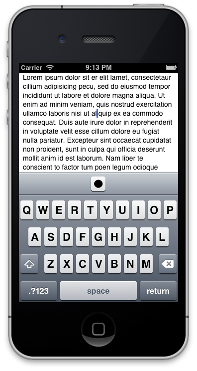

UDBarTrackballItem
==================

## Overview

`UDBarTrackballItem` is a button view for iOS which can position the text cursor (caret) and define the text selection of a text view in parallel to its touch drag movement. The user interaction pattern is similar to a [Thinkpad TrackPoint](http://en.wikipedia.org/wiki/Pointing_stick).

The intention was to create a text navigation component for text editor apps that makes the task of frequent text positioning and selection more convenient. The default way of positioning and selection requires a touch down delay to distinguish view scrolling and editing mode as well as the magnifying glass which distract the precise positioning more that it helps. The tradeoff is a decrease in view real-estate for the input accessory view bar (which is quite common in text editors nowadays).

It is implemented as a `UIBarButtonItem` subclass to control the caret movement and text selection of a `UITextView` and intended to be use inside a `InputAccessoryView` (`UIToolbar`).

[Screencast of the sample project example](https://www.youtube.com/watch?v=7WquTtzEsRs)



## Features

- Single tap dragging cursor (caret) positioning
- Double tap dragging text selection
- Auto scrolling of text view when positioning out of bound
- Auto popup editing menu after positioning or selection
- Horizontal side-to-side reach distance without re-tap
- Horizontal and vertial layout orientations
- Uses ARC and targets iOS 5.0+

## Installation

To use `UDBarTrackballItem` in your own project:

- Import `UDBarTrackballItem.h` and `UDBarTrackballItem.m` and all png image files into your project
- Include `UDBarTrackballItem.h` (`#import "UDBarTrackballItem.h"`) where needed, or in your precompiled header
- Initialize the new `UDBarTrackballItem` for a `UITextView`

This project uses ARC and targets iOS 5.0+.

## Usage

```objective-c
UDBarTrackballItem *trackballItem = [[UDBarTrackballItem alloc] initForTextView:_textView];
[_toolbar setItems:@[trackballItem] animated:YES];
```

## Credits

[Write](http://writeapp.net/) app for the innovative inspiration for and first-time appearance of this component.

## License

This code is distributed under the terms and conditions of the MIT license. Review the full [LICENSE](LICENSE) for all the details.

## Support/Contact

Think you found a bug or just have a feature request? Just [post it as an issue](https://github.com/djui/UDBarTrackballItem/issues), but make sure to review the existing issues first to avoid duplicates. You can also hit me up at [@uwe_](http://twitter.com/uwe_) for anything else, or to let me know how you're using this component. Thanks!
